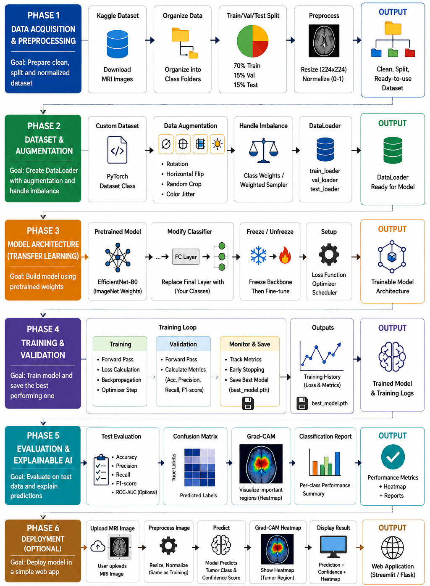

# 🧠 Brain Tumor Detection using EfficientNet-B0

An end-to-end deep learning project for classifying brain MRI images into four categories using **EfficientNet-B0 Transfer Learning** and providing **Grad-CAM visual explanations** for model predictions.

The project includes MRI image preprocessing, data augmentation, class imbalance handling, transfer learning, model training, evaluation, explainable AI, and an optional Streamlit web application for deployment.

---

## 📌 Project Overview

Brain tumor classification from MRI images is an important computer vision problem. This project aims to develop a deep learning-based system that can classify MRI images into four classes:

- **Glioma**
- **Meningioma**
- **No Tumor**
- **Pituitary**

The trained model uses **EfficientNet-B0** as the backbone and provides prediction confidence along with a **Grad-CAM heatmap** to visualize image regions that influenced the prediction.

---

## 🏗️ Project Architecture

The complete pipeline consists of the following phases:



### Phase 1 — Data Acquisition & Preprocessing

- Dataset acquisition
- Organizing MRI images into class folders
- Train / Validation / Test split
- Image resizing to `224 × 224`
- Image normalization
- Optional image enhancement such as CLAHE

### Phase 2 — Dataset & Augmentation

- Custom PyTorch Dataset
- Data augmentation
- Rotation
- Horizontal Flip
- Random Crop
- Color Jitter
- Class imbalance handling
- Weighted sampling
- PyTorch DataLoader

### Phase 3 — Model Architecture

- Transfer Learning
- EfficientNet-B0
- ImageNet pretrained architecture
- Custom classifier head
- Backbone freezing and fine-tuning
- Cross-Entropy Loss
- Optimizer and learning-rate scheduler

### Phase 4 — Training & Validation

- Training loop
- Forward propagation
- Loss calculation
- Backpropagation
- Optimizer update
- Validation
- Accuracy, Precision, Recall and F1-score monitoring
- Best model checkpointing
- Early stopping

### Phase 5 — Evaluation & Explainable AI

The trained model is evaluated using:

- Accuracy
- Precision
- Recall
- F1-score
- Confusion Matrix
- Classification Report
- ROC-AUC (optional)

For explainability, **Grad-CAM** is used to generate heatmaps showing important image regions contributing to the model's prediction.

### Phase 6 — Deployment

The trained model is deployed using **Streamlit**.

The deployment workflow is:

```text
Upload MRI Image
       ↓
Image Preprocessing
       ↓
EfficientNet-B0
       ↓
Prediction
       ↓
Confidence Score
       ↓
Grad-CAM Heatmap
       ↓
Display Result
```

---

## 🤖 Model

### EfficientNet-B0

The project uses **EfficientNet-B0** with transfer learning.

The pretrained backbone is adapted for four-class brain MRI classification by replacing the original classifier with a custom classification head.

### Classes

| Class | Description |
|---|---|
| Glioma | Glioma tumor |
| Meningioma | Meningioma tumor |
| No Tumor | MRI image without detected tumor |
| Pituitary | Pituitary tumor |

---

## 📂 Project Structure

```text
Brain_Tumor_Detection/
│
├── README.md
├── architecture.png
├── .gitignore
├── requirements.txt
│
├── 1_Brain_Tumor_Detection.ipynb
│
└── brain_tumor_deployment/
    │
    ├── app.py
    ├── brain_tumor_model.pth
    └── class_names.json
```

---

## 🛠️ Tech Stack

- **Python**
- **PyTorch**
- **Torchvision**
- **EfficientNet-B0**
- **NumPy**
- **Pillow**
- **Matplotlib**
- **Scikit-learn**
- **Streamlit**
- **Grad-CAM**
- **CUDA / GPU** for model training (if available)

---

## 📊 Evaluation Metrics

The model can be evaluated using the following metrics:

- Accuracy
- Precision
- Recall
- F1-score
- Confusion Matrix
- Classification Report
- ROC-AUC

---

## 🔥 Explainable AI — Grad-CAM

To improve model interpretability, Grad-CAM is used to visualize the regions of the MRI image that contributed most to the model's prediction.

The deployment application provides:

```text
Original MRI
      +
Grad-CAM Heatmap
      +
Predicted Class
      +
Confidence Score
```

This helps users understand which regions of the image received stronger attention from the model.

---

## 🚀 Installation

### 1. Clone the repository

```bash
git clone https://github.com/YOUR_USERNAME/Brain-Tumor-Detection-EfficientNetB0.git
```

Move into the project directory:

```bash
cd Brain-Tumor-Detection-EfficientNetB0
```

---

### 2. Create a virtual environment

For Python 3.10:

```bash
python -m venv .venv
```

Activate it on Windows:

```bash
.venv\Scripts\activate
```

---

### 3. Install dependencies

```bash
pip install -r requirements.txt
```

---

## 🌐 Run the Streamlit Application

Navigate to the deployment folder:

```bash
cd brain_tumor_deployment
```

Run:

```bash
streamlit run app.py
```

The application will open in the browser.

Usually the local application will be available at:

```text
http://localhost:8501
```

---

## 🖥️ Web Application

The Streamlit application allows the user to:

1. Upload a brain MRI image
2. Preprocess the image
3. Classify the MRI using EfficientNet-B0
4. Display the predicted tumor class
5. Display prediction confidence
6. Generate a Grad-CAM heatmap
7. Display class probabilities

---

## 📦 Model Files

The deployment folder contains:

```text
brain_tumor_deployment/
│
├── app.py
├── brain_tumor_model.pth
└── class_names.json
```

### `app.py`

Streamlit application responsible for:

- Image upload
- Preprocessing
- Model inference
- Prediction display
- Confidence score
- Grad-CAM visualization

### `brain_tumor_model.pth`

Trained EfficientNet-B0 model weights.

### `class_names.json`

Contains the class names used by the trained model.

---

## 📓 Training Notebook

The complete training and evaluation workflow is available in:

```text
1_Brain_Tumor_Detection.ipynb
```

The notebook contains the implementation of the project pipeline from preprocessing to evaluation.

---

## 📁 Dataset

Dataset Link : 👉 **[Brain Tumor MRI Dataset – Kaggle](https://www.kaggle.com/datasets/masoudnickparvar/brain-tumor-mri-dataset/versions/1)**

The dataset contains MRI images belonging to four categories:

```text
Glioma
Meningioma
No Tumor
Pituitary
```

To reproduce the project, obtain the dataset from its original source and place it according to the directory structure expected by the notebook.

---

## 🔬 Reproducibility

To reproduce the project:

```text
Dataset
   ↓
Preprocessing
   ↓
Train / Validation / Test Split
   ↓
Augmentation
   ↓
EfficientNet-B0
   ↓
Training
   ↓
Validation
   ↓
Best Model
   ↓
Test Evaluation
   ↓
Grad-CAM
   ↓
Streamlit Deployment
```

---


## ⭐ Future Improvements

Possible future improvements include:

- Hyperparameter optimization
- More extensive data augmentation
- Ensemble models
- EfficientNet variants comparison
- Improved class imbalance handling
- External dataset validation
- Model calibration
- Advanced explainability methods
- Cloud deployment
- Improved Streamlit interface

---

## 📜 License

This project is intended for educational and research purposes.
